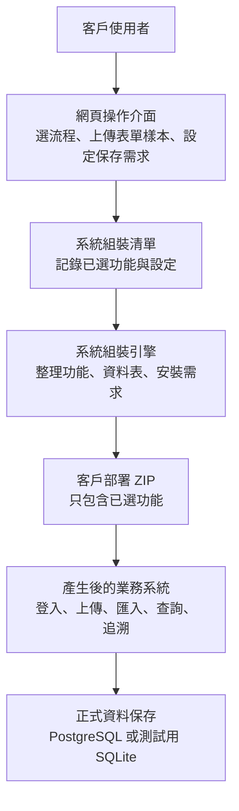
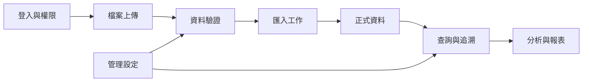
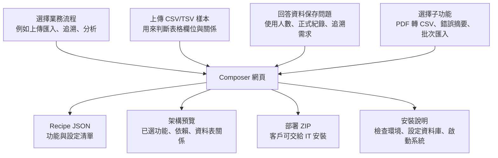
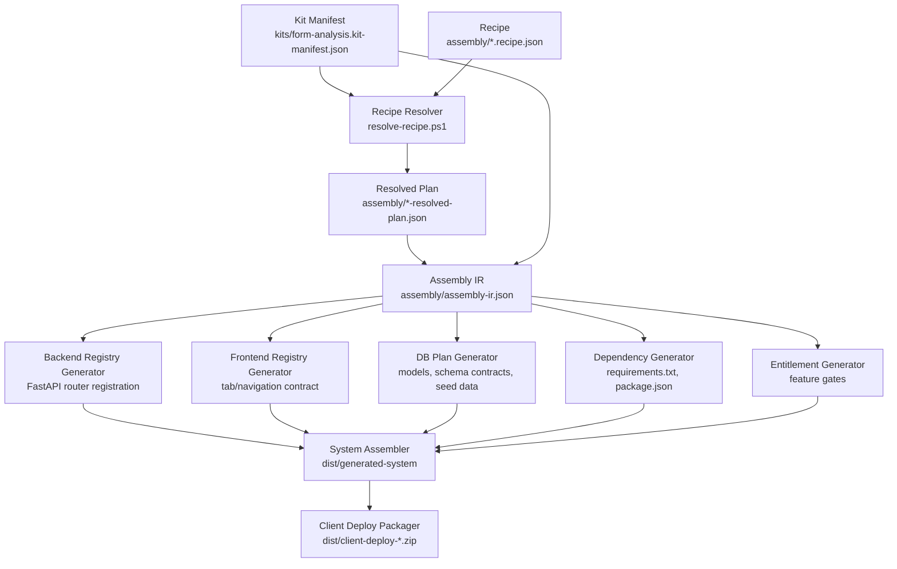
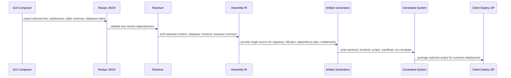
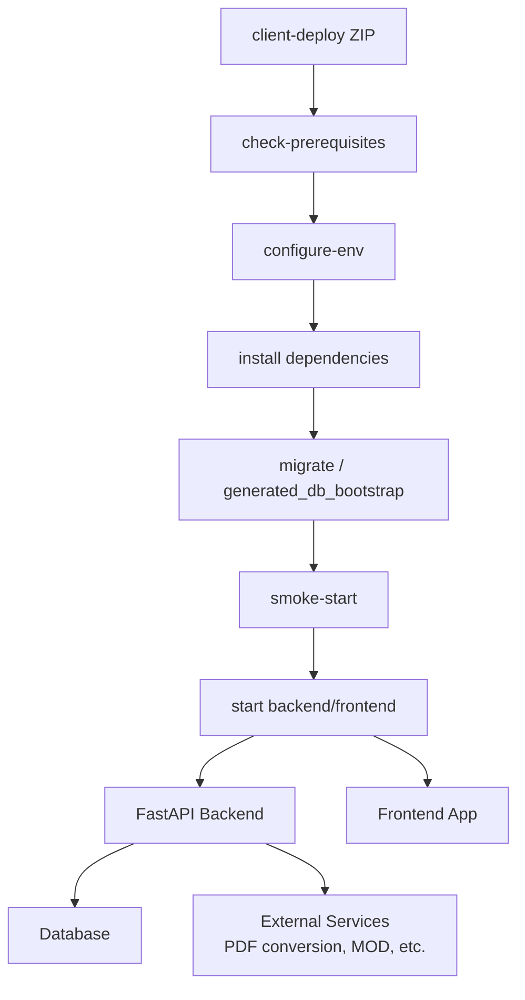
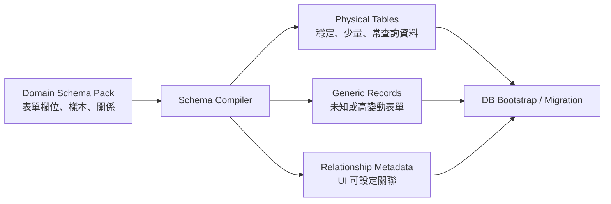

# Form System Kit Composer Architecture Diagrams

本文件提供兩種架構圖版本：

- 客戶版：用業務語言說明平台如何從網頁操作產生部署套件。
- 開發者版：用工程語言說明 GUI、Recipe、Assembly IR、generator、generated runtime package 之間的資料流與責任邊界。

## 客戶版：系統架構 Breakdown

### 客戶版重點

- 客戶不用理解前端、後端、SQLAlchemy 或 package.json。
- 客戶在網頁上選擇需要的業務流程，平台產生只包含那些功能的 ZIP。
- 資料庫選擇用「資料保存需求」描述：是否多人使用、是否正式紀錄、是否需要追溯與報表。
- 正式環境建議使用 PostgreSQL；展示或測試可以使用 SQLite。

## 客戶版：各功能間如何溝通

### 客戶版溝通說明

- 登入與權限決定使用者可以操作哪些功能。
- 上傳功能接收 CSV、Excel 或 PDF 轉換結果。
- 驗證功能檢查欄位、格式、必填值與業務規則。
- 匯入工作把通過驗證的資料寫入正式資料區。
- 查詢與追溯從正式資料中查批號、產品、站點或關聯流程。
- 分析與報表使用查詢結果產生圖表或摘要。
- 管理設定可調整站點、欄位關係、驗證規則與分析 mapping。

## 客戶版：網頁操作 Input & Output

## 開發者版：Assembly Engine Breakdown

### 開發者版責任邊界

- Manifest 是 kit source of truth。
- Recipe 是使用者選擇結果。
- Resolved Plan 解決 kit dependency order。
- Assembly IR 是所有 generator 的共同中介 contract。
- Registry generators 不應自行重新推論 recipe。
- DB generator 負責 schema mode、seed data、relationship metadata。
- Package generator 只包 selected kits 與共用 runtime scripts。

## 開發者版：Function Communication

## 開發者版：Generated Runtime Package

### Runtime Input & Output

| 操作階段 | Input | Output |
| --- | --- | --- |
| GUI 選配 | 業務流程、子功能、資料保存需求、CSV/TSV 樣本 | Recipe JSON、預覽、組裝指令 |
| Assembly | Recipe、Kit Manifest、Schema Baseline、Dependency Baseline | Assembly IR、registry、DB plan、dependency plan |
| Package | Generated system folder | Client deploy ZIP |
| Install | ZIP、`.env`、資料庫連線資訊 | 已安裝 backend/frontend dependencies |
| Migrate | DB plan、SQLAlchemy models、Alembic 或 bootstrap | 可用資料庫 schema 與 seed data |
| Runtime | 使用者登入、檔案上傳、查詢條件、管理設定 | 匯入工作、正式資料、追溯結果、報表 |

## 開發者版：資料保存與 Schema 策略

### Schema 策略說明

- 預設採 hybrid physical-first。
- 穩定且少量的客戶表單可以產生獨立 physical table。
- 不穩定或欄位常變動的資料保留在 generic records。
- 表單間關聯用 metadata 管理，先支援 UI 設定與 traceability query，再視需求升級成硬 FK。
