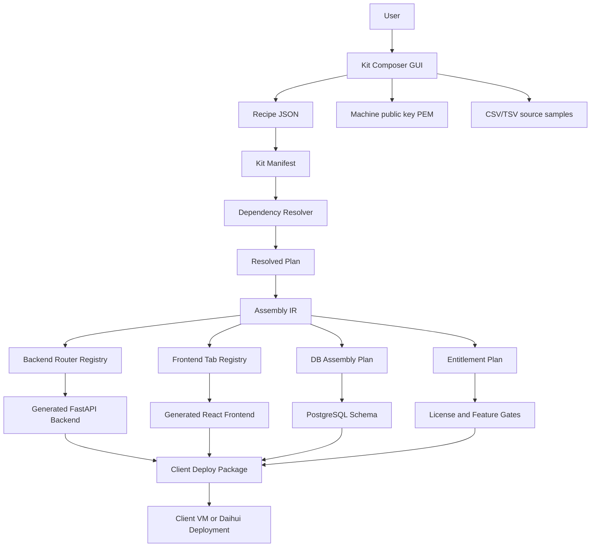
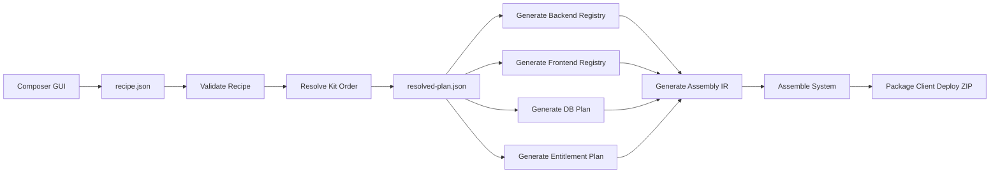
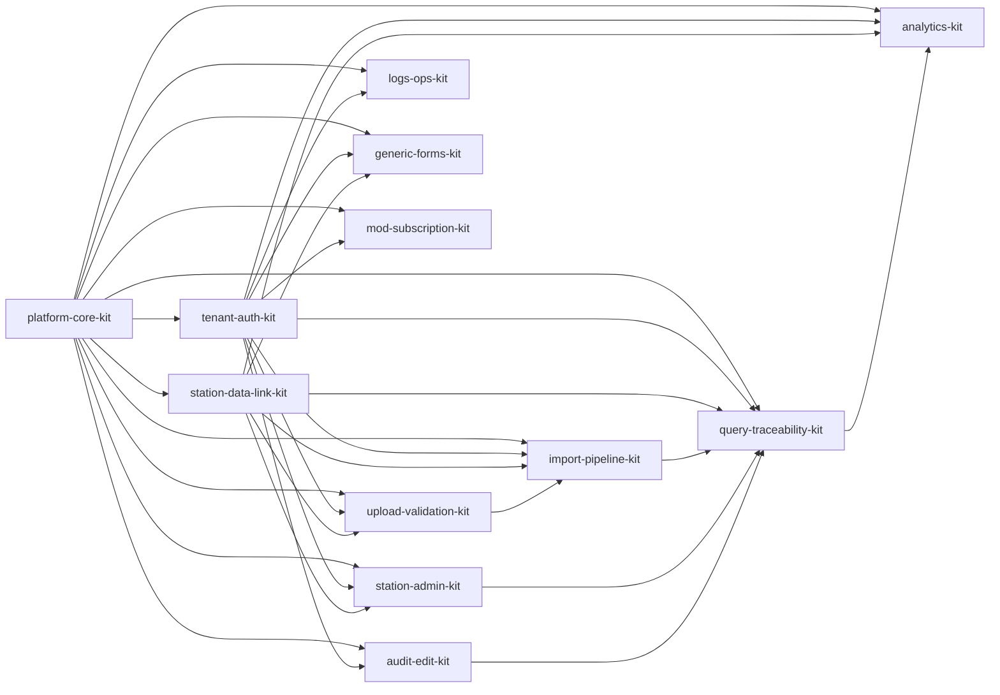
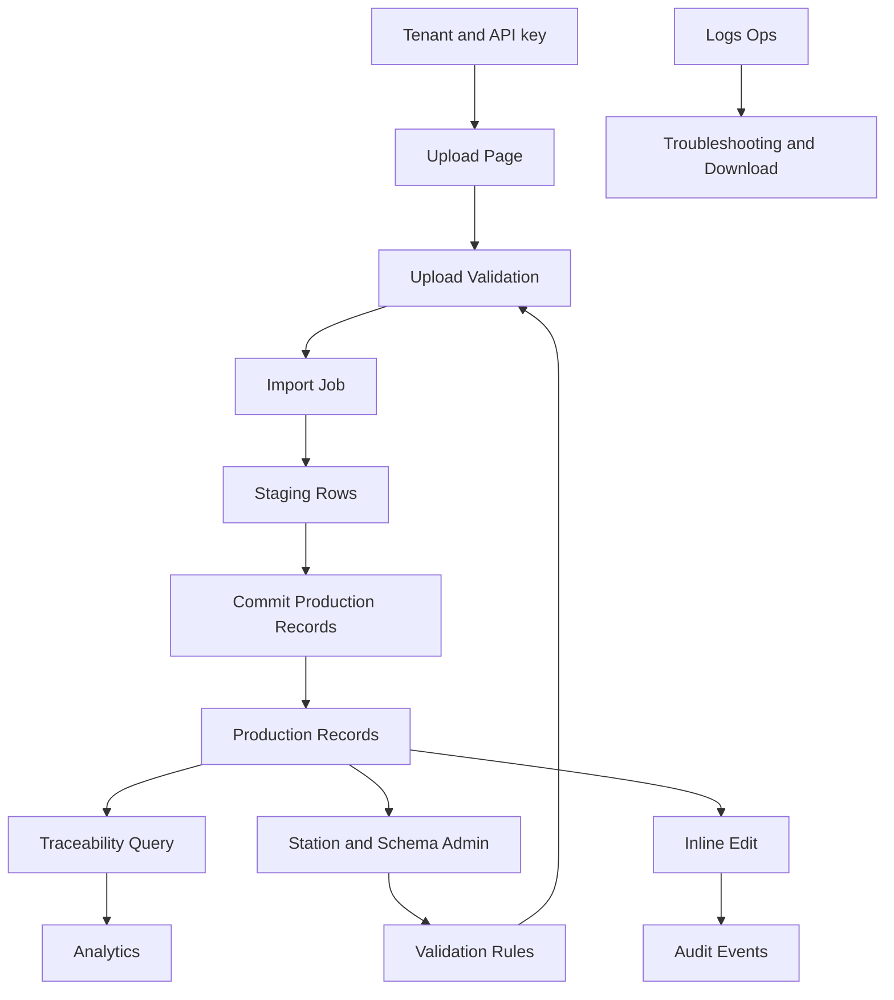
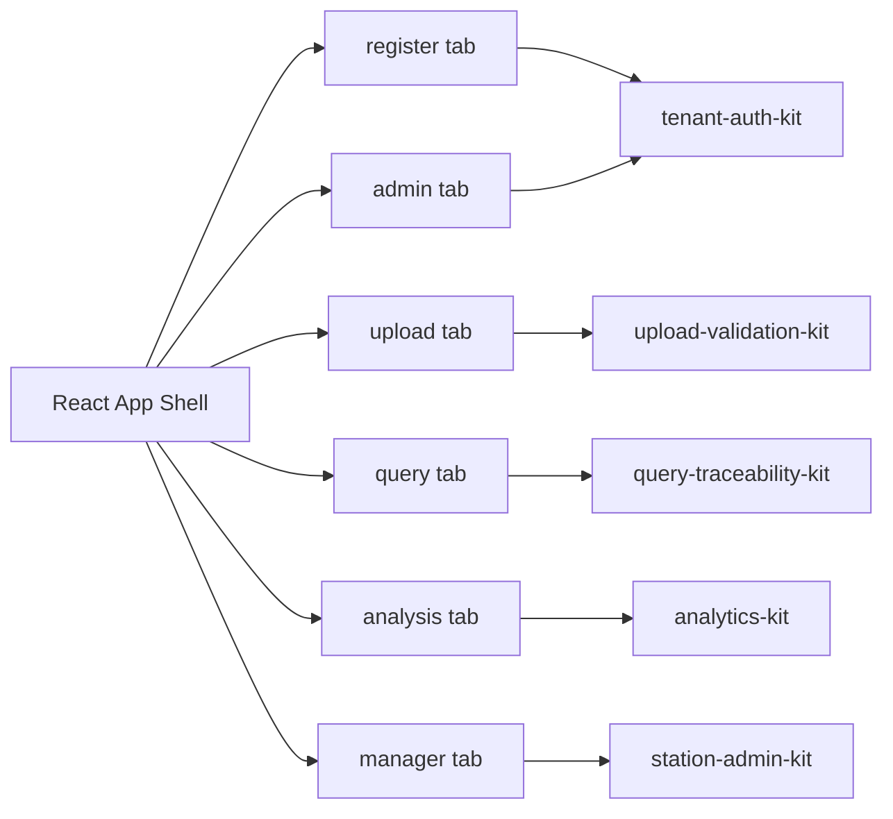
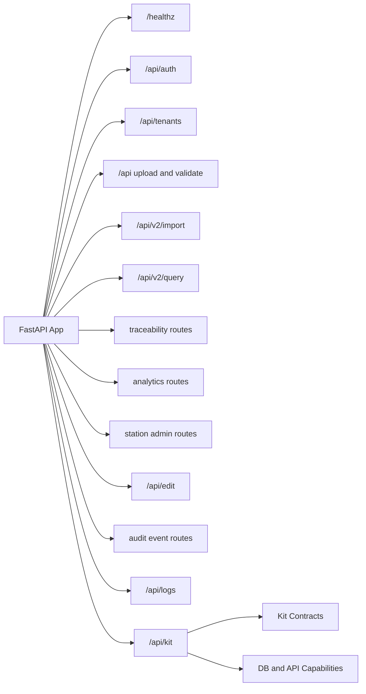
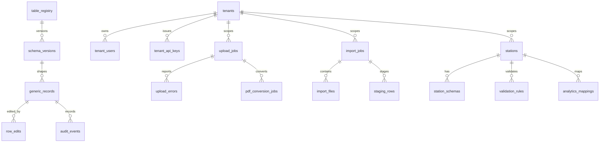
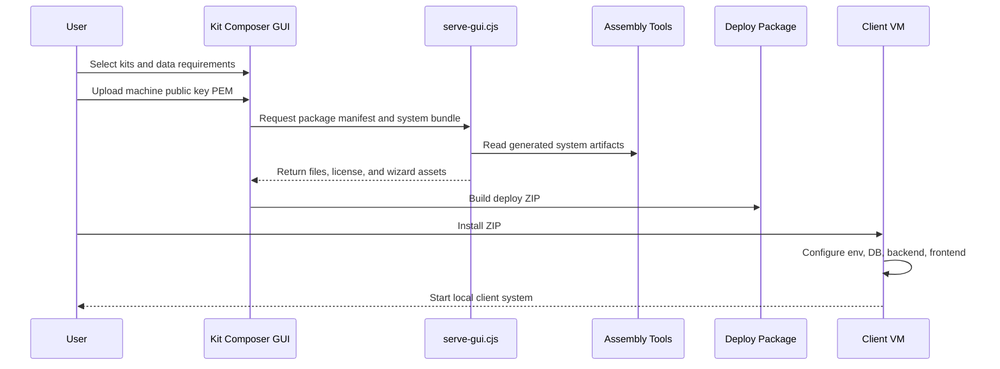

# Form System Kit Composer Knowledge Graph

This document initializes the project knowledge graph. It is based on the current kit manifest, resolved assembly plan, backend registry, frontend registry, DB assembly plan, and GUI/tooling layout.

## Source Map

| Knowledge Area | Source |
| --- | --- |
| Kit catalog and dependencies | `kits/form-analysis.kit-manifest.json` |
| Selected kit order and enabled APIs | `assembly/resolved-plan.json` |
| Assembly IR and install plan | `assembly/assembly-ir.json` |
| Backend router registration | `assembly/backend-registry/backend-router-registry.json` |
| Frontend navigation tabs | `assembly/frontend-registry/frontend-tab-registry.json` |
| Database schema plan | `assembly/db-plan/db-assembly-plan.json` |
| Composer GUI and local API | `gui/*`, `tools/serve-gui.cjs` |
| Packaging and deployment scripts | `tools/*.ps1`, `dist/*` |

## Project Graph

## Assembly Pipeline

## Kit Dependency Graph

## Runtime Capability Graph

## Frontend Navigation Graph

## Backend API Graph

## Database Knowledge Graph

## Packaging and Client Runtime Graph

## Knowledge Graph Maintenance Rules

- Update this document when adding a new kit, router registry, frontend tab, DB table group, or deploy phase.
- Prefer adding a focused graph instead of expanding one diagram beyond readability.
- Keep node ids ASCII and labels quoted when using CJK text.
- Treat `assembly/*.json` as generated knowledge sources and `kits/*.kit-manifest.json` as source-of-truth inputs.
- Cross-check generated runtime behavior against `dist/client-deploy-gui-selected-form-system/system` before claiming a kit is active in client deployments.
